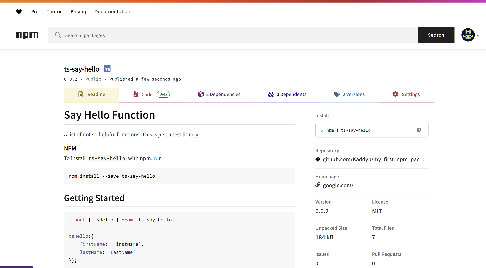

# Say Hello Function 

A list of not so helpful functions. This is just a test library.

### NPM
To install `ts-say-hello` with npm, run

```bash
npm install --save ts-say-hello
```

## Getting Started

```JavaScript
import { tsHello } from 'ts-say-hello';

tsHello({
    firstName: 'FirstName',
    lastName: 'LastName'  
});

```

### Node Package
